:::::::: cr-section
::: {#cr-map1}
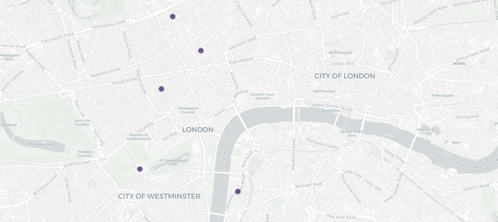
:::

::: {#cr-map2}
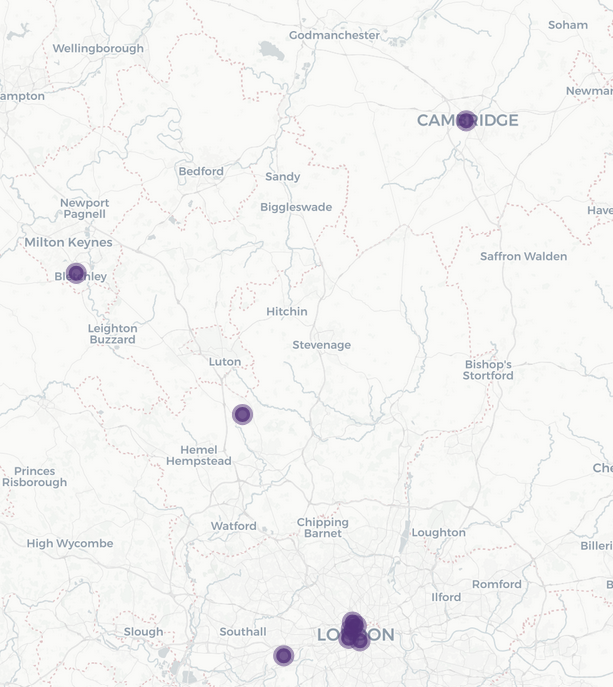
:::

::: {#cr-map3}
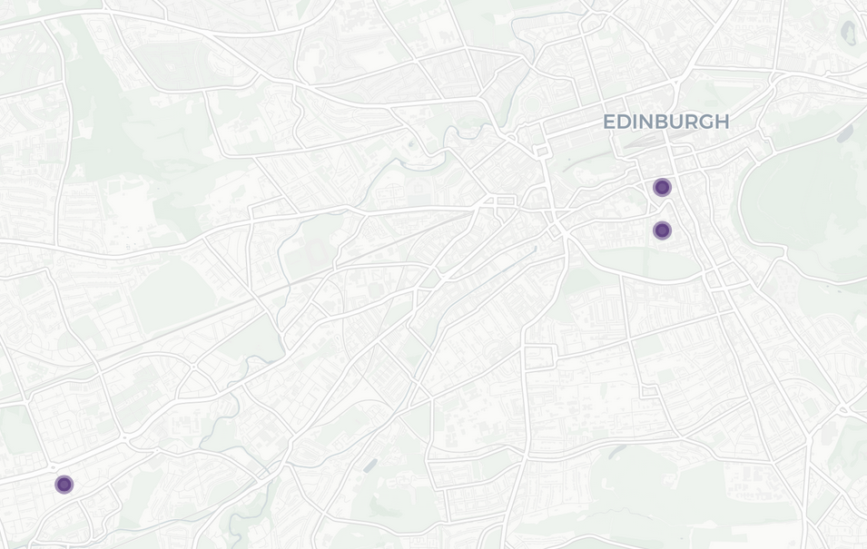
:::

::: {#cr-map4}
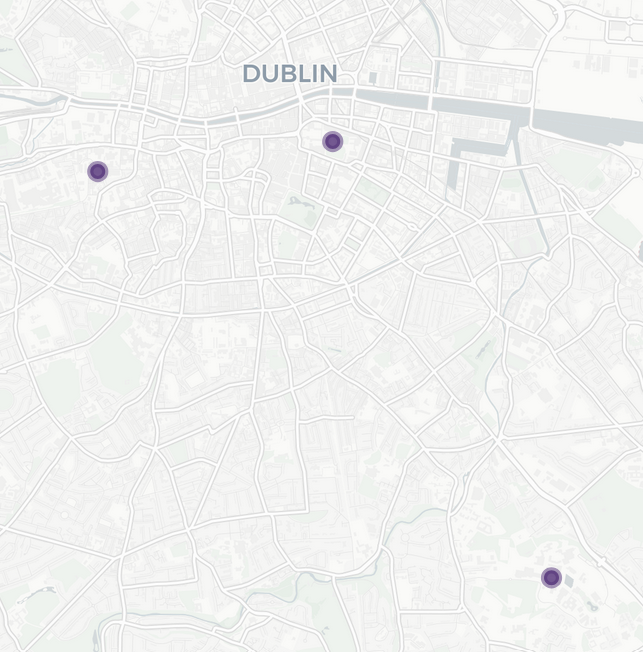
:::

::: {#cr-map5}
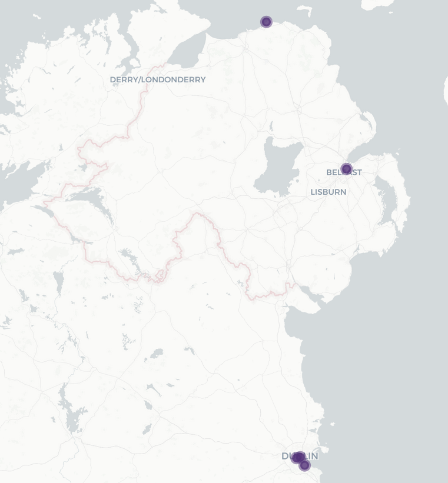
:::

This talk is about an abroad course I taught on the history of statistics. We started in Mount Vernon, Iowa, and our first destination was London!

We started with a bus tour of London that my sleep-deprived students described as a "near psychedelic experience."

This is an abridged version of the course....

## UCL and Eugenics: Subhadra Das

@cr-map1

Subhadra Das was a "Curator of the Science Collections at University College London where she was also Researcher in Critical Eugenics at the Sarah Parker Remond Centre for the Study of Racism and Racialisation" (https://www.subhadradas.com/)

She gave us a walking tour around the UCL campus. Check out her podcast, Bricks and Mortals.

As you may know, Francis Galton, Karl Pearson, and Sir Ronald A. Fisher were all eugenicists. This fact sparked many conversations around the globe about names of awards, buildings, and more.

"Galton Lecture Theatre had been renamed Lecture Theatre 115, the Pearson Lecture Theatre changed to Lecture Theatre G22 and the Pearson Building to the North-West Wing", UCL News

"Summer of 2020, GEE took the collective decision to rename the RA Fisher Centre for Computational Biology as the UCL Centre for Computational Biology"(https://www.ucl.ac.uk/biosciences/gee/ucl-centre-computational-biology/ronald-aylmer-fisher-1890-1962)

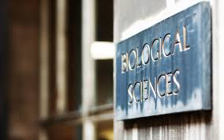

## University College London (UCL) Archives

UCL holds a massive assortment of historical papers, letters, and more, such as letters between Fisher and Pearson in their archives.

The *learning session* was designed in consultation with their librarians and archivists (at no cost)!

One example, the Working papers for ‘Hereditary Genius’: statistical tables and calculations for the number of gifted relations across families, etc., 1860s by Galton.

## Florence Nightingale Museum

@cr-map1

Widely considered the founder of modern nursing. Her emphasis on hygiene, patient care, and nursing education revolutionized healthcare practices and professionalized nursing.

During the Crimean War (1853–1856), she drastically improved sanitary conditions at British field hospitals, reducing the death rate from 42% to 2%. Her work earned her the nickname "The Lady with the Lamp" for making nightly rounds to care for wounded soldiers.

Nightingale was also a statistician who used innovative data visualizations, like her famous "coxcomb" diagrams, to present mortality data and argue for healthcare reform. She was among the first to use statistics to influence public health policy.

### Florence Nightingale's Coxcomb

## Speaker: Dr. Mary Gregory, UK Population Statistics Directorate

@cr-map1

Dr. Gregory highlighted differences in government between the US and UK. She aslo provided the students with a great opportunity to ask about the current use of statistics in the UK.

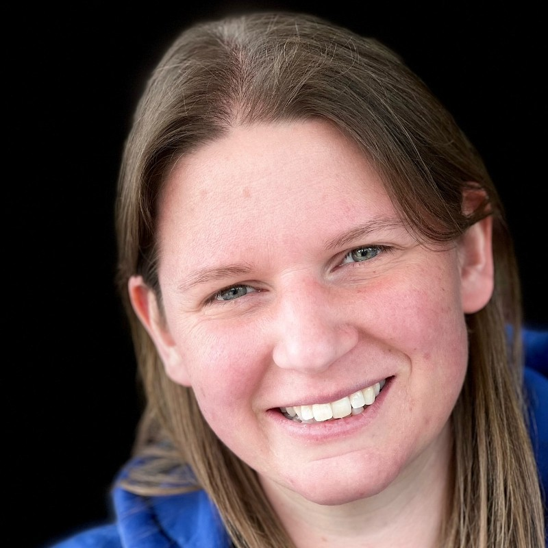

## Bletchley Park in Bletchley

@cr-map2

Among many achievements, while working at Bletchley Park, Alan Turing and Max Newman used Bayesian inference and probability theory to break German codes—particularly the Enigma and Lorenz ciphers.

The Colossus computer, developed to break the Lorenz cipher, helped automate the analysis of intercepted messages by identifying statistical patterns in ciphertext. We saw the Colossus in action at the *National Museum of Computing*.

Students learned about ciphers and interacted with an Enigma machine—the exact machine used in *The Imitation Game* movie.

## Cambridge

@cr-map2

We went on a two-hour walking tour (in the rain).

Establishment of the Statistical Laboratory in 1947.

Some of the figures who studied at Cambridge (various colleges): CR Rao (Cramer Rao Lower Bound, Rao-Blackwell), Ronald A. Fisher (Fisher Exact Test), and Frank Yates (incomplete block design)

## Rothamsted Research in Harpenden

@cr-map2

Rothamsted hosts some of the longest-running agricultural experiments in the world, like the Broadbalk Wheat Experiment, which began in 1843.

Sir Ronald A. Fisher developed key statistical techniques while working at Rothamsted in the 1920s. These included Analysis of Variance (ANOVA) and experiment design, which revolutionized agricultural and biological research.

Rothamsted maintains a rich open-access repository of over 150 years of data (https://www.era.rothamsted.ac.uk/), including crop yields, soil chemistry, and meteorological data. These datasets are a goldmine for statistical analysis, time-series modeling, and environmental forecasting.

## University of Edinburgh Archives

@cr-map3

We attended a *Learning Session* organized by the University of Edinburgh Archives. We primarily focused on plots in books by William Playfair or by individuals directly inspired by Playfair.

### Who is William Playfair (the statistician, 1823)?

He is credited with inventing the bar chart (1786), the line graph (1786), the pie chart (1801), and the area chart.

Playfair wasn’t formally trained in statistics—he was a Scottish engineer, economist, and political writer. He used visualizations to make economic and political arguments more persuasive, proving that powerful ideas don't always come from traditional paths.

In his book The Commercial and Political Atlas (1786), Playfair used graphs to illustrate Britain’s trade with other countries. This was revolutionary at the time and made complex data far more accessible and intuitive.

## Speaker Zhaoxi Zhang, Royal Statistical Society (RSS)

RSS was founded in 1834 and is now over 190 years old, and one of the world's oldest and most influential statistical organizations. Through its publications, professional standards, and advocacy, it plays a pivotal role in shaping statistics as a formal discipline.

Zhang delivered a talk,”Story of Scottish Statistics.” He later wrote a paper on the topic and has won the RSS Statistical Excellence Award for Early-Career Writing for this year!

## Napier University

@cr-map3

Location of Merchiston's Tower that was owned by John Napier (1550-1617), the creator of the logarithm.

Now, Napier University is built around it. Two of our students presented a collaborative research project on text analysis with Scottish Gaelic, and we walked the tower.

Why not climb a dead volcano (Arthur's Seat)?

## City 3: Dublin, Ireland

## Guinness Storehouse

@cr-map4

### William Sealy Gosset (1876-1937)

Best known for developing the t-test, a statistical method for determining whether there is a significant difference between the means of two groups.

Worked as a statistician at the Guinness Brewery in Dublin, Ireland.

To protect his work's confidentiality, he published under the pseudonym "Student," leading to the common name Student's t-test.

Unfortunately, our tour guide at Guinness only gave a short spiel on Gosset.

But, for some reason, the students still very much enjoyed the visit...

## Speaker: Dr. Shane Whelan

@cr-map4

Worked at the Central Statistics Office (CSO) of Ireland and University College Dublin (now enjoying watching a lot more fencing).

A longstanding member and secretary of The Statistical and Social Inquiry Society of Ireland (SSISI).

Founded in 1847, it promotes the study of statistics, economics, and social science in Ireland through public lectures, research, and policy discussions.

## Ireland Countryside

@cr-map5

::::::::

This is a course, though. What about teaching it?

::: cr-section
# Brief Learning Objectives

-   Navigate unfamiliar cultures and environments with awareness.

-   Embrace ambiguity in new or challenging situations.

-   Engage meaningfully with people and places abroad.

-   Reflect critically on your own and others’ cultures.

-   Explore the origins of statistics and its ties to eugenics.

-   Discover the technologies that shaped modern statistics.

-   Connect today’s world with its historical foundations.

# Pedagogy

**Design Principles** The course emphasized modular, place-based learning with critical reflection at its core. Assignments were structured to deepen understanding of both the history of statistics and the cultural context.

**Assignments**

-   Readings: The Lady Tasting Tea by David Salsburg, and excerpts from F. Galton and K. Pearson.

-   Reflections: Structured synthesis of site visits and readings, life experiences, or prior classes.

-   Activities: Field-based assignments, such as exploring the Titanic dataset before and during visiting the museum.

-   Final Reflection: Summative integration of learning.

**Experience Reflection Example:** *Reflect in at least 400 words on the experience. This should include a description of the experience and a synthesis of at least two of 1) assigned course readings, 2) your own life experiences and/or other people's stories you have heard, 3) other course content and conversations, and 4) prior statistical knowledge.*

Reflections were evaluated on a four-point scale (1 = Below Basic to 4 = Advanced) across four dimensions: Understanding, Quality, Quantity, and Mechanics.

**Engaging with Bias and History** Students were encouraged to wrestle with the ethical legacies of key figures and the role of statistics in promoting — or challenging — social injustice.

**Course Design Challenges** The course had to be designed for flexibility — allowing asynchronous work, learning in any order, and completing reflections in unpredictable settings like buses or cafés.

# Student Feedback

Students desired clearer feedback on reflections.

Many expressed interest in having more free time and engaging in cultural exploration.

Some viewed the reflections as less meaningful — suggesting a need to better integrate them with on-site experiences.

The course was an amazing experience for them (but sadly, I fear the learning lacked)

## The whole course, at a glance

Neccessary? No. Fun and engaging? Yes!

You can see the itinerary at **bit.ly/STATS_UKnIR** (QR code at the end).

22 total days!

Equally significant cultural component.
:::

::: cr-section

# Looking Forward

Re-run course in Fall 2027 (lead: Dr. Cannon).

Revise materials to strengthen history/culture integration and to connect reflections to cultural/statistical learning better.

Improve the integration of parts of historical papers by Pearson and others

Consistent classroom meeting space.
:::

## Closing Thoughts

-   Huge acknowledgment to Beth Johnson and David Holmes.

-   Our course has now spawned at least two others!

-   A manuscript is in the planning stages.

-   Presentation created with Quarto Extension Closeread by Andrew Bray

-   *Tgeorge\@cornellcollege.edu*.

::::: columns
::: column
## Website QR Code (bit.ly_STATS_UKnIR)

:::

::: column
## Shiny Map (bit.ly/StatsUKIMap)

:::
:::::

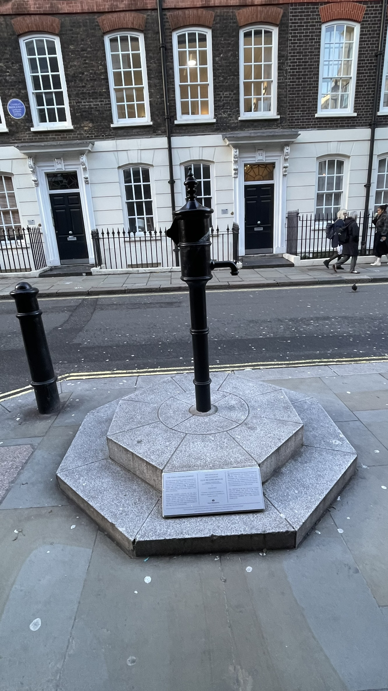

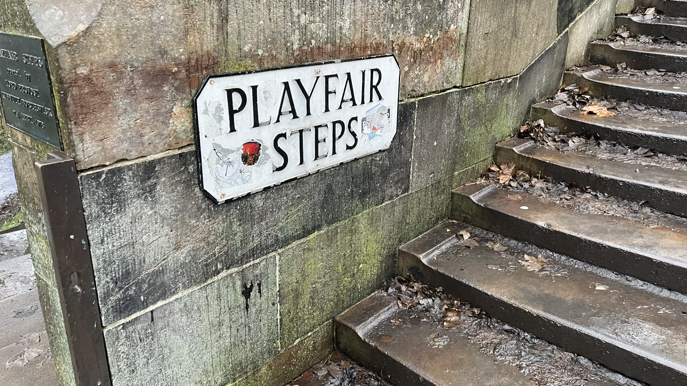

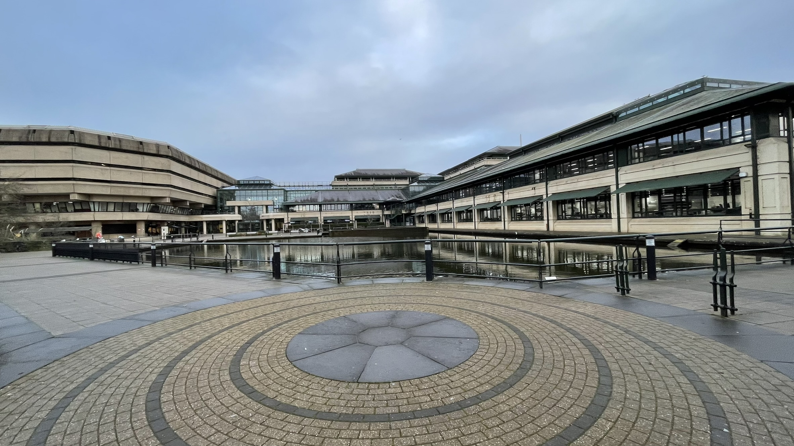

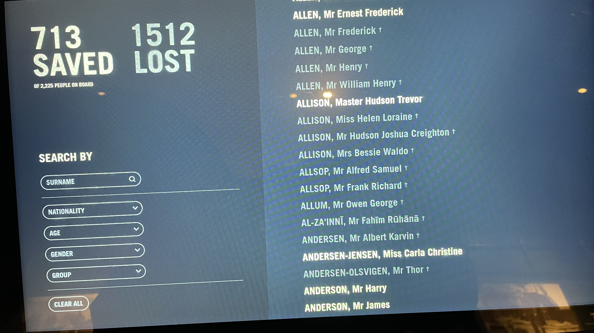