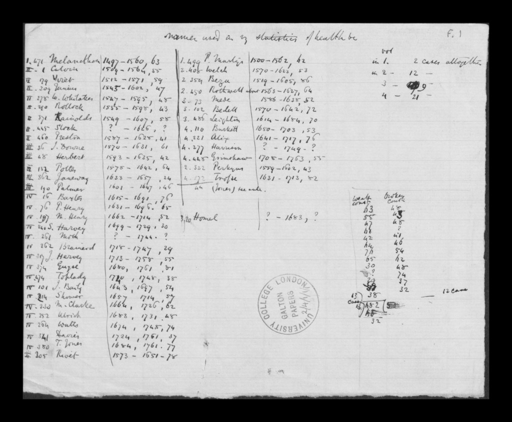
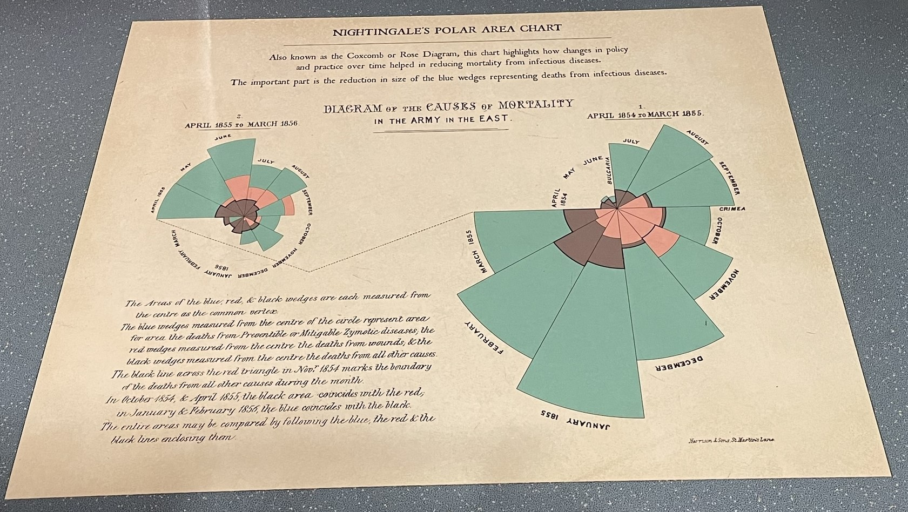
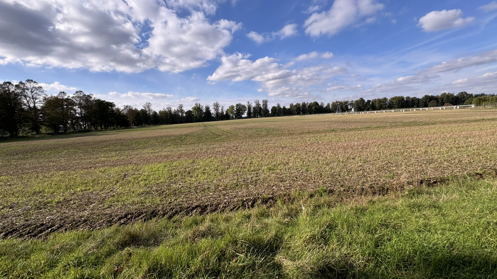
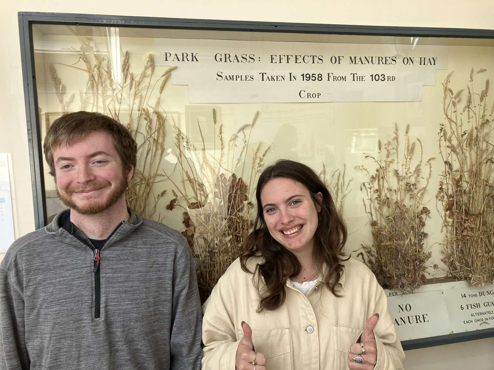
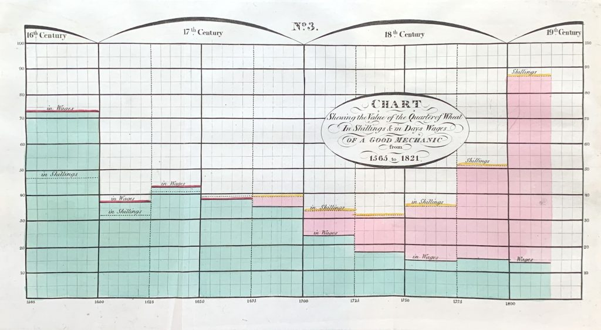
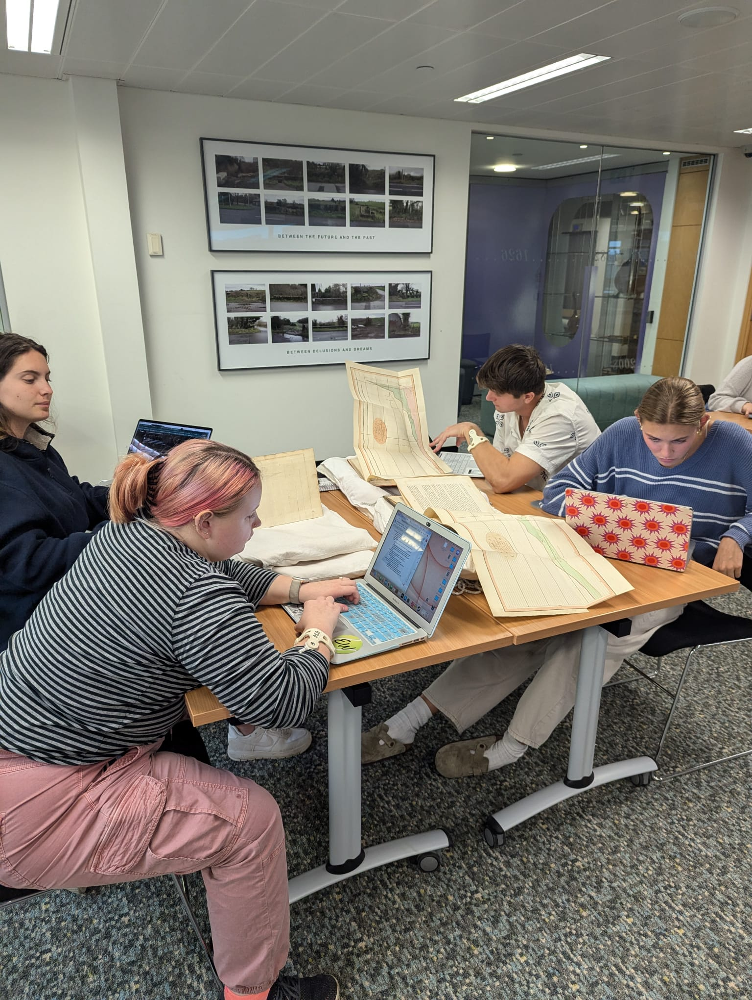
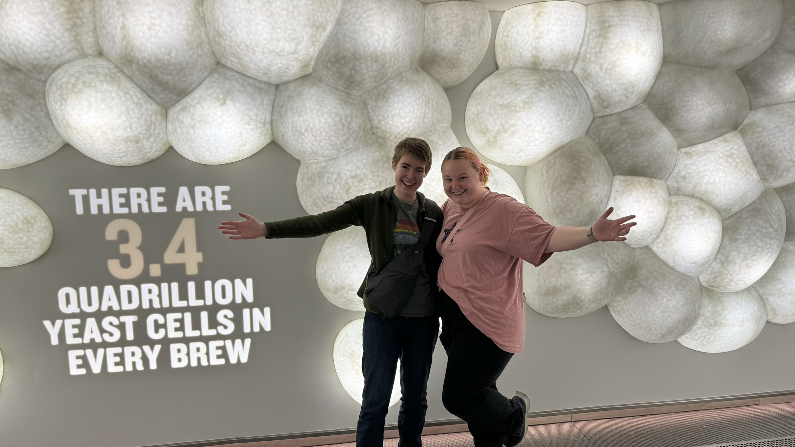
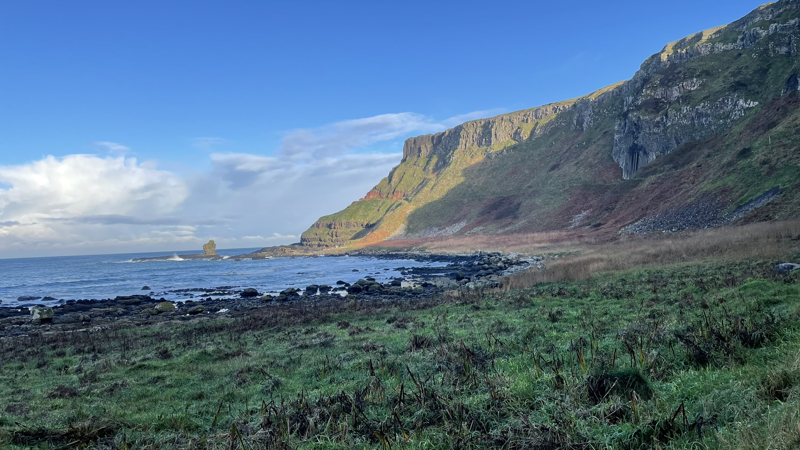
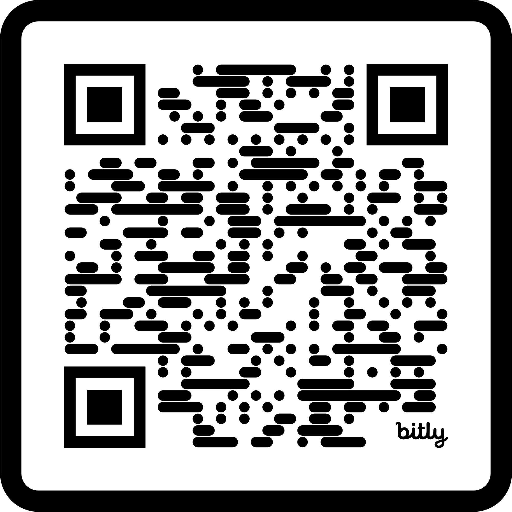
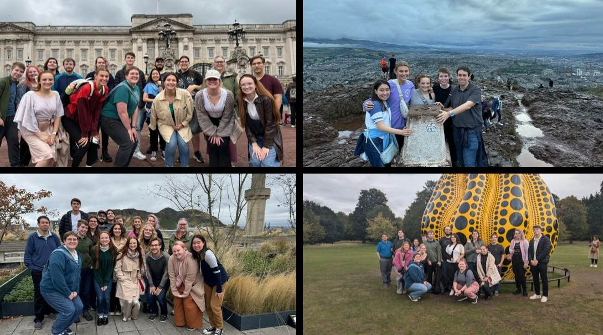

# Course Description

In this course, students explored the origins of statistics by tracing the lives and work of key figures in the UK and Ireland. From correlation and hypothesis testing to cryptography, data visualization, and experimental design, students critically examined both the breakthroughs and biases that shaped modern statistics.

# Shortened Learning Objectives

*   Navigate unfamiliar cultures and environments with awareness.

*   Embrace ambiguity in new or challenging situations.

*   Engage meaningfully with people and places abroad.

*   Reflect critically on your own and others’ cultures.

*   Explore the origins of statistics and its ties to eugenics.

*   Discover the technologies that shaped modern statistics.

*   Connect today’s world with its historical foundations.

# Pedagogy

**Design Principles** The course emphasized modular, place-based learning with critical reflection at its core. Assignments were structured to deepen understanding of both history of statistics and cultural context.

**Assignments** 

* Readings: The Lady Tasting Tea by David Salsburg, and excerpts from F. Galton and K. Pearson.

* Reflections: Structured synthesis of site visits and readings, life experiences, or prior classes.

* Activities: Field-based assignments, such as exploring the Titanic dataset before and during visiting the museum.

* Final Reflection: Summative integration of learning.

**Experience Reflection Example** *Reflect in at least 400 words on the experience. This should include a description of the experience and a synthesis of at least two of 1) assigned course readings, 2) your own life experiences and/or other people's stories you have heard, 3) other course content and conversations, and 4) prior statistical knowledge.*

Reflections were evaluated on a four-point scale (1 = Below Basic to 4 = Advanced) across four dimensions: Understanding, Quality, Quantity, and Mechanics.

**Engaging with Bias and History** Students were encouraged to wrestle with the ethical legacies of key figures and the role of statistics in promoting — or challenging — social injustice.

**Course Design Challenges** The course had to be designed for flexibility — allowing asynchronous work, learning in any order, and completing reflections in unpredictable settings like buses or cafés.

# London & Beyond

**University College London (UCL) Archives** Handled an assortment of artifacts, many originals, including working papers and proofs. One artifact was the working papers for ‘Hereditary Genius’: statistical tables and calculations for the number of gifted relations across families, etc., 1860s by F. Galton.

{width="36%"}&nbsp;&nbsp;&nbsp;{width="52%"}

*Hereditary Genius (Working Paper)* &nbsp;&nbsp;&nbsp;&nbsp;&nbsp;&nbsp;*Florence Nightingale's Coxcomb Plot*

**Florence Nightingale Museum** During the Crimean War (1853–1856), Florence Nightingale drastically improved sanitary conditions at British field hospitals, reducing the death rate from 42% to 2%. Her work earned her the nickname "The Lady with the Lamp" for making nightly rounds to care for wounded soldiers. Nightingale was also a statistician who used innovative data visualizations, such as her famous "coxcomb" diagrams, to present mortality data and advocate for healthcare reform. She was among the first to use statistics to influence public health policy.

**University College London (UCL) and Eugenics** We took a tour led by former UCL archivist and writer Subhadra Das, exploring the university’s role in the eugenics movement. We visited buildings formerly named after prominent eugenicist statisticians. Much of this is documented in her podcast Bricks and Mortals.

**Rothamsted Research in Harpenden** Rothamsted Research hosts some of the longest-running agricultural experiments in the world, like the Broadbalk Wheat Experiment, which began in 1843. Sir Ronald A. Fisher developed key statistical techniques while working at Rothamsted in the 1920s. These included Analysis of Variance (ANOVA) and experiment design, which revolutionized agricultural and biological research.

{width="45%"}&nbsp;&nbsp;&nbsp;{width="34%"}

*Field and Students from Visit to Rothamsted Research*

**Bletchley Park and The National Museum of Computing** Alan Turing and Max Newman employed Bayesian inference and probability theory to break German codes—particularly the Enigma and Lorenz ciphers — during World War II. Turing also developed a statistical procedure called Banburismus, which used frequency analysis and probability to reduce the number of Enigma settings that needed to be checked. The Colossus computer, developed to break the Lorenz cipher, helped automate the analysis of intercepted messages by identifying patterns in ciphertext - we saw it in action!

# Edinburgh

**University of Edinburgh Archives** William Playfair (1759-1823) lived and worked in Edinburgh and is credited with inventing the bar chart (1786), the line graph and area chart (1786), and the pie chart (1801). In his book The Commercial and Political Atlas (1786), Playfair used graphs to illustrate Britain’s trade with other countries. This was revolutionary at the time, making complex data far more accessible and intuitive. Students focused on plots in books by Playfair or written by individuals inspired by Playfair. 

{width="50%"}&nbsp;&nbsp;&nbsp;{width="21%"}

*Playfair's "A Letter on Our Agricultural Distresses"* &nbsp;&nbsp;&nbsp;&nbsp; *Students at Edinburgh's Archive* 

**Royal Statistical Society** The Royal Statistical Society (RSS), founded in 1834 and now over 190 years old, is one of the world's oldest and most influential statistical organizations. Through its publications, professional standards, and advocacy, it plays a pivotal role in shaping statistics as a formal discipline. They organized a speaker for our class, Zhaoxi Zhang, who delivered a talk titled "Story of Scottish Statistics."

# Dublin & Beyond

**Guinness Brewery** William Sealy Gosset (1876-1937) is best known for developing the t-test, a statistical method used to determine whether there is a significant difference between the means of two groups. He worked as a statistician at the Guinness Brewery in Dublin, Ireland. To protect the confidentiality of his work, he published under the pseudonym "Student," leading to the common name "Student's t-test."

{width="50%"}&nbsp;&nbsp;&nbsp;{width="50%"}

*Guinness Storehouse, Dublin, Ireland* $\hspace{1in}$ &nbsp;&nbsp;*Giants Causeway, Northern Ireland*

# Student Feedback

* Students desired clearer feedback on reflections.

* Many expressed interest in more free time and cultural exploration.

* Some viewed the reflections as less meaningful — suggesting a need to better integrate them with on-site experiences.

# Looking Forward

* Re-run course in Fall 2027 (lead: Dr. Cannon).

* Revise materials to strengthen history/culture integration and to better connect reflections to cultural/statistical learning.

* Consistent classroom meeting space.

# Acknowledgments

-   Dr. Beth Johnson and Dr. David Holmes, University of Florida. Their course inspired this course, and they graciously shared their materials.

-   ASA Section of Statistics and Data Science Education. Their Member Initiative grant helped fund an exploratory trip to plan the course.

# Course Materials & Travel Map

{width="3.5in"}&nbsp;&nbsp;&nbsp;&nbsp;&nbsp;&nbsp;&nbsp;&nbsp;&nbsp;&nbsp;&nbsp;&nbsp;&nbsp;&nbsp;&nbsp;&nbsp;&nbsp;&nbsp;&nbsp;&nbsp;&nbsp;&nbsp;&nbsp;&nbsp;&nbsp;&nbsp;&nbsp;&nbsp;&nbsp;&nbsp;&nbsp;&nbsp;&nbsp;&nbsp;&nbsp;&nbsp;&nbsp;&nbsp;&nbsp;&nbsp;&nbsp;&nbsp;&nbsp;&nbsp;&nbsp;&nbsp;&nbsp;&nbsp;{width="3.5in"}

*Course Materials (bit.ly_STATS_UKnIR)* $\hspace{1in}$ *Shiny Travel Map (bit.ly_StatsUKIMap)*

{width="12in"}
